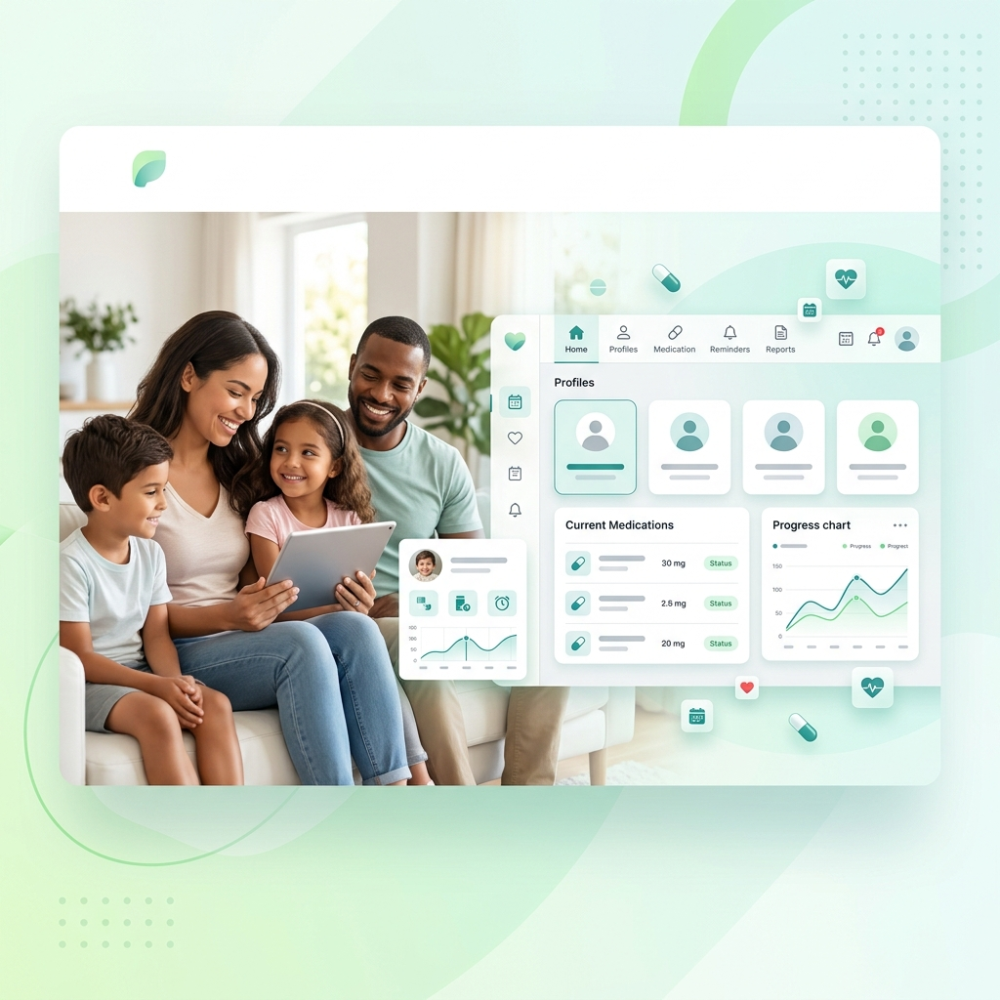

<div align="center">
  

  # صِحتنا | The Family Health Companion

  *A Serverless, Local-First Medical Utility App for Medication Adherence.*
</div>

---

## 🌟 Overview

**The Family Health Companion (صِحتنا)** is a robust, production-ready progressive web application (PWA) built to help families track and manage their medications effectively. By leveraging local-first architecture and service workers, it provides interactive, reliable, and secure health management without the need for an external backend server.

### ✨ Key Features

- **Local-First Architecture:** Uses `Dexie.js` (IndexedDB wrapper) to securely store all patient and medication data directly on the user's device. No servers, no data privacy concerns.
- **Bilingual Interface:** Full support for both English (LTR) and Arabic (RTL) out-of-the-box, ensuring accessibility across different demographics.
- **Interactive Reminders:** Utilizes Service Workers with Notification Actions to push meal-based and time-based medication reminders. Users can log adherence directly from notifications (e.g., "Yes, I ate" / "Not yet").
- **Strict SEO & SSR:** Employs Next.js Server Components for strict technical SEO. All text and metadata are Server-Side Rendered (SSR).
- **Responsive & Premium UI:** Designed using Tailwind CSS with a clean, light-themed, modern medical aesthetic, prioritizing readability and ease of use.

---

## 🛠️ Technology Stack

- **Framework:** [Next.js (App Router)](https://nextjs.org/)
- **Language:** [TypeScript](https://www.typescriptlang.org/)
- **Styling:** [Tailwind CSS](https://tailwindcss.com/)
- **Database:** [Dexie.js](https://dexie.org/) (Client-side IndexedDB wrapper)
- **PWA & Offline:** Native Service Workers + Web App Manifest

---

## 🚀 Getting Started

### Prerequisites

Ensure you have [Node.js](https://nodejs.org/) installed (v18.17+ recommended).

### Installation

1. **Clone the repository:**
   ```bash
   git clone https://github.com/your-username/the-family-health-companion.git
   cd the-family-health-companion
   ```

2. **Install dependencies:**
   ```bash
   npm install
   # or yarn install, pnpm install, bun install
   ```

3. **Run the development server:**
   ```bash
   npm run dev
   ```

4. **Open the application:**
   Navigate to [http://localhost:3000](http://localhost:3000) in your browser.

---

## 🏗️ Architecture & Coding Standards

To maintain code quality and project consistency, please adhere to the following rules when contributing:

1. **Client-Side Database:** **Always** isolate `Dexie.js` database access to client-side code (`"use client"`) to prevent Next.js Node.js server build crashes (`"window is not defined"`).
2. **SEO Metadata:** Every page folder must have a static `metadata` object exported for SEO, fully supporting both Arabic and English.
3. **Clean Translations:** Maintain strict internationalization (i18n). Extract all hardcoded text to the central translation dictionary.

---

## 📄 License

This project is licensed under the [MIT License](LICENSE).
